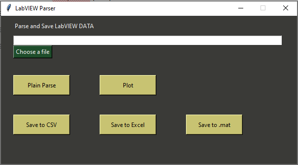
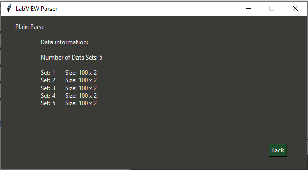
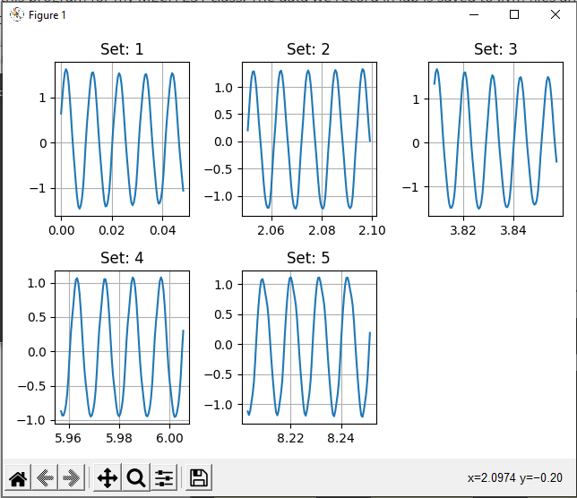

# LabVIEW Data Parser

A program that parses through LabVIEW data and saves it to various file types such as CSV, Excel, or MATLAB.

### About

I made this program for my MECH 231 class. The data we record in lab is saved to .lvm files and I wanted to create a program that would convert that data into more usable forms such as CSV, Excel or MATLAB files.

### Current Functionality

- Get information about the data (Plain Parse)
- Plot the data with matplotlib (Plot)
- Save data to a CSV file (Save to CSV)
- Save data to a Excel file (Save to Excel)
- Save data to a MATLAB file (Save to .mat)

### Images

